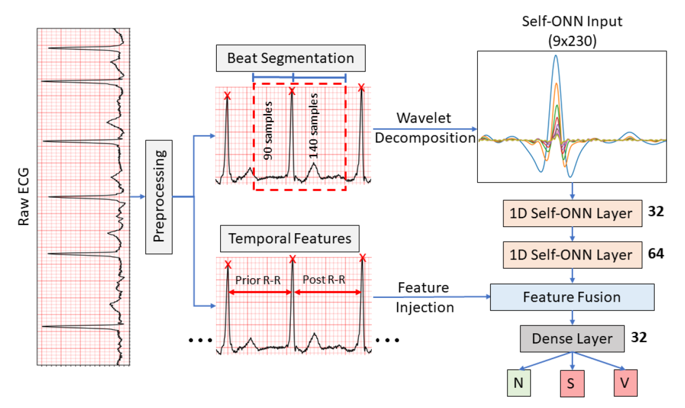

# Global ECG Classification by Self-Operational Neural Networks with Feature Injection

## Overview

This repository implements an approach for global ECG classification using Self-Operational Neural Networks (Self-ONNs) with feature injection, designed to classify arrhythmias using the MIT-BIH dataset. Our model uses temporal and morphological features from ECG signals, achieving high accuracy while maintaining a compact and computationally efficient architecture.

The method outlined in this repository is based on the paper:
> **Global ECG Classification by Self-Operational Neural Networks with Feature Injection**  
> _Muhammad Uzair Zahid, Serkan Kiranyaz, and Moncef Gabbouj_  
> IEEE Transactions on Biomedical Engineering, Vol. 70, No. 1, January 2023.

### Project Structure
1. **Data Preprocessing**: `ecg_data_processing.py` — Processes raw ECG signals, aligns R-peaks, calculates wavelet coefficients, and generates datasets for model training and testing.
2. **Model Training**: `main.py` — Implements the 1D Self-ONN model with feature injection and trains it on preprocessed data.

---

## Table of Contents
- [Overview](#overview)
- [Installation](#installation)
- [Data Preparation](#data-preparation)
- [Running the Code](#running-the-code)
- [Model Architecture](#model-architecture)
- [Results](#results)
- [Contact and Collaboration](#contact-and-collaboration)
- [References](#references)

---

## Installation

1. **Clone the repository:**
   ```bash
   git clone https://github.com/MUzairZahid/Global-ECG-Classification-by-Self-Operational-Neural-Networks-With-Feature-Injection.git
   cd yourrepo
   ```

2. **Download the MIT-BIH dataset:**
   Download the MIT-BIH Arrhythmia Database from [PhysioNet](https://physionet.org/content/mitdb/1.0.0/).

3. **Install dependencies:**
   - Install Python packages from `requirements.txt`.
   - Install the **fastonn** library for Self-ONNs:
     ```bash
     git clone https://github.com/junaidmalik09/fastonn
     cd fastonn
     pip install .
     ```

---

## Data Preparation

1. **Preprocess the ECG data:**
   Use `ecg_data_processing.py` to preprocess the raw ECG data, align R-peaks, compute wavelet coefficients, and create training/testing datasets.

   ```bash
   python ecg_data_processing.py --raw_data_dir ./mit-bih-arrhythmia-database-1.0.0 --processed_data_dir ./MITBIH_data_processed
   ```

   This will save the processed data as `mitbih_processed.pkl` in the `processed_data_dir` directory.

---

## Running the Code

1. **Train the Model:**
   Run `main.py` after preprocessing the data. Specify paths and parameters as required.
   ```bash
   python main.py --wavelet_type "mexh" --sampling_rate 360 --q 3 --processed_data_path ./MITBIH_data_processed/mitbih_processed.pkl --save_model_dir ./saved_models
   ```

   ### Arguments for `main.py`:
   - `wavelet_type`: Type of wavelet to use (default: "mexh").
   - `sampling_rate`: Sampling rate of ECG signals (default: 360 Hz).
   - `q`: Degree of non-linearity for Self-ONN (default: 3).
   - `processed_data_path`: Path to the preprocessed data.
   - `save_model_dir`: Directory to save the trained model.

---

## Model Architecture

The proposed 1D Self-ONN model is designed to effectively capture the morphological and temporal features of ECG signals. Key components include:

- **Self-ONN Layers**: Extract morphological features from ECG beats.
- **Feature Injection**: Temporal features based on R-R intervals are injected into the Self-ONN model for enriched classification.

The architecture is illustrated in the figure below:

>  
> *Figure 1: Block diagram of the proposed approach and model architecture for classification of ECG signals.*

---

## Results

Our model achieved state-of-the-art performance on the MIT-BIH dataset, with the following metrics:

- **Normal Beats (N)**: Precision: 99.21%, Recall: 99.10%, F1-score: 99.15%
- **Supra-Ventricular Ectopic Beats (SVEBs)**: Precision: 82.19%, Recall: 82.50%, F1-score: 82.34%
- **Ventricular Ectopic Beats (VEBs)**: Precision: 94.41%, Recall: 96.10%, F1-score: 95.20%

>   
> *Figure 2: ROC curves for SVEB and VEB beat classification.*

>   
> *Figure 3: Confusion matrix for classification on the MIT-BIH dataset.*

These results demonstrate that our Self-ONN approach can perform high-accuracy arrhythmia classification with minimal computational overhead, making it feasible for real-time, low-power ECG monitoring devices.

---

## Contact and Collaboration

For any questions, issues, or potential collaboration inquiries, please contact:

**Muhammad Uzair Zahid**  
Email: [muhammaduzair.zahid@tuni.fi](mailto:muhammaduzair.zahid@tuni.fi)  
LinkedIn: [https://www.linkedin.com/in/uzair-zahid/](https://www.linkedin.com/in/uzair-zahid/)
---


## References

1. Zahid, M. U., Kiranyaz, S., & Gabbouj, M. (2023). "Global ECG Classification by Self-Operational Neural Networks With Feature Injection." *IEEE Transactions on Biomedical Engineering*, 70(1), 205–214.
2. MIT-BIH Arrhythmia Database. Available at: [https://physionet.org/content/mitdb/1.0.0/](https://physionet.org/content/mitdb/1.0.0/)
3. FastONN: GPU-based library for Operational Neural Networks. Available at: [https://github.com/junaidmalik09/fastonn](https://github.com/junaidmalik09/fastonn)
